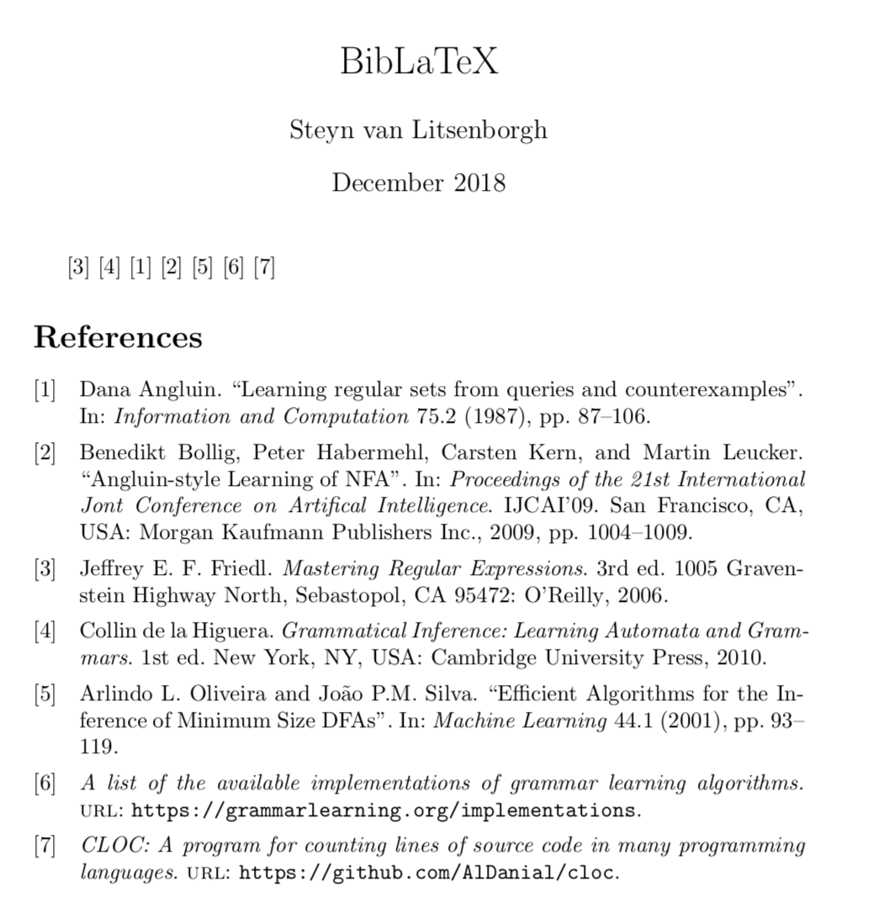

# BibLaTeX
This repository contains a program to transform a LaTex bib file, so that misc entries are either placed at the bottom or top (depending on your preference), which will separate literature and misc entries in the rendered bibliography.

## Prerequisites
It is assumed that you have Python 3.5.2 or higher installed on your system.

## Example run
In [bibligraphy.bib](resources/bibligraphy.bib) we have a LaTeX bib file that given the code

```tex
\documentclass{article}
\usepackage[utf8]{inputenc}
\usepackage[backend=biber,date=iso8601,maxbibnames=99,urldate=iso8601]{biblatex}

\addbibresource{bibliography.bib}

\title{BibLaTeX}
\author{Steyn van Litsenborgh}
\date{December 2018}

\begin{document}
\maketitle
\cite{friedl_mastering_2006}
\cite{de_la_higuera_grammatical_2010}
\cite{angluin_learning_1987}
\cite{bollig_angluin-style_2009}
\cite{oliveira_efficient_2001}
\cite{noauthor_list_nodate}
\cite{noauthor_program_nodate}
\printbibliography
\end{document}

```
will render the following


Running the command below
```bash
git clone https://github.com/steynvl/biblatex.git
cd biblatex
./main.py resources/bibliography.bib bottom
```
will produce the file [bibligraphy-new.bib](resources/bibligraphy-new.bib), which TeX will render as



## License

This project is licensed under the MIT License - see the [LICENCE.md](LICENCE.md) file for details.
